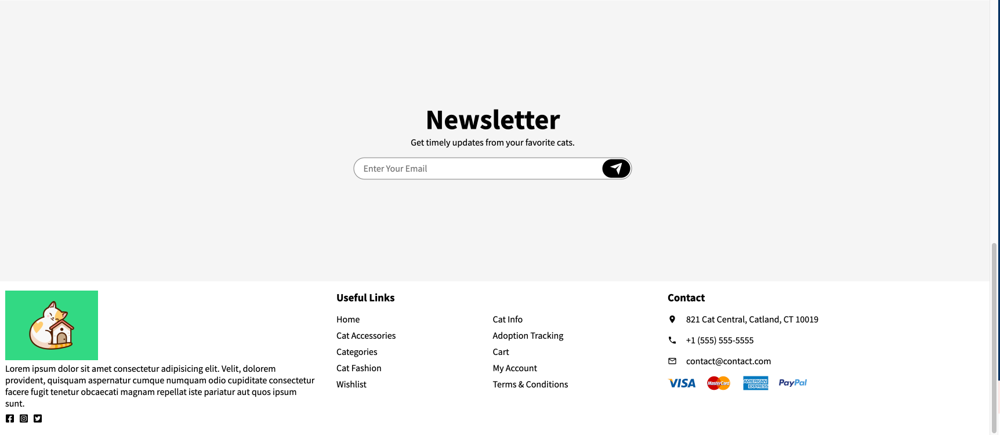

# Cats for Everyone!

## Find the newest addition to your family!

Everyone loves pets and looking for one can be daunting. Our app is specifically focused on cat adoption for cat lovers! Our app allows users to view all the cats that are up for adoption and create a profile page where they could favorite their potential pet choice that they could come back to later. 

## User Story

I want to view different cats on the website with their names and pictures. So that I can easily see which ones are available for adoption. 

As a user, I want to be able to have my own profile page. In the profile page, I should be able to access all the animals that I have favorited for potential adoption. 

## Technologies Used

Node.js, React, Express.js, MongoDB, Redux, Bootstrap, JWT, Apollo, deployed on Heroku

# Getting Started with Create React App

This project was bootstrapped with [Create React App](https://github.com/facebook/create-react-app).

## Available Scripts

In the project directory, you can run:

### `npm start`

Runs the app in the development mode.\
Open [http://localhost:3000](http://localhost:3000) to view it in your browser.

The page will reload when you make changes.\
You may also see any lint errors in the console.

### `npm test`

Launches the test runner in the interactive watch mode.\
See the section about [running tests](https://facebook.github.io/create-react-app/docs/running-tests) for more information.

### `npm run build`

Builds the app for production to the `build` folder.\
It correctly bundles React in production mode and optimizes the build for the best performance.

The build is minified and the filenames include the hashes.\
Your app is ready to be deployed!

See the section about [deployment](https://facebook.github.io/create-react-app/docs/deployment) for more information.

### `npm run eject`

**Note: this is a one-way operation. Once you `eject`, you can't go back!**

If you aren't satisfied with the build tool and configuration choices, you can `eject` at any time. This command will remove the single build dependency from your project.

Instead, it will copy all the configuration files and the transitive dependencies (webpack, Babel, ESLint, etc) right into your project so you have full control over them. All of the commands except `eject` will still work, but they will point to the copied scripts so you can tweak them. At this point you're on your own.

You don't have to ever use `eject`. The curated feature set is suitable for small and middle deployments, and you shouldn't feel obligated to use this feature. However we understand that this tool wouldn't be useful if you couldn't customize it when you are ready for it.

## Learn More

You can learn more in the [Create React App documentation](https://facebook.github.io/create-react-app/docs/getting-started).

To learn React, check out the [React documentation](https://reactjs.org/).

### Code Splitting

This section has moved here: [https://facebook.github.io/create-react-app/docs/code-splitting](https://facebook.github.io/create-react-app/docs/code-splitting)

### Analyzing the Bundle Size

This section has moved here: [https://facebook.github.io/create-react-app/docs/analyzing-the-bundle-size](https://facebook.github.io/create-react-app/docs/analyzing-the-bundle-size)

### Making a Progressive Web App

This section has moved here: [https://facebook.github.io/create-react-app/docs/making-a-progressive-web-app](https://facebook.github.io/create-react-app/docs/making-a-progressive-web-app)

### Advanced Configuration

This section has moved here: [https://facebook.github.io/create-react-app/docs/advanced-configuration](https://facebook.github.io/create-react-app/docs/advanced-configuration)

### Deployment

This section has moved here: [https://facebook.github.io/create-react-app/docs/deployment](https://facebook.github.io/create-react-app/docs/deployment)

### `npm run build` fails to minify

This section has moved here: [https://facebook.github.io/create-react-app/docs/troubleshooting#npm-run-build-fails-to-minify](https://facebook.github.io/create-react-app/docs/troubleshooting#npm-run-build-fails-to-minify)

## Contributors

Scott Wattenbarger, Dennis Mateo, Kristina Litunovskaia, Kaihuan Huang, Maryam Muska, Kevin Rivera

## Application Links

# Cat App


## Table of Contents
* [Description](#description)
* [Assets](#assets)
* [Assets](#assets)
* [Installation](#installation)
* [Usage](#usage)
* [Contributing](#contributing)
* [Questions](#questions)

## Description
Cat-App is a fully functioning MERN-stack single-page application built with a React front end, MongoDB database, and Node.js/Express.js server and API. It's already set up to allow users to save cats, adopt cats.

- Deployed link: https://github.com/scottwatt/Cat-app-trial
- Live: 


## More details
```
Use React for the front end.

Use GraphQL with a Node.js and Express.js server.

Use MongoDB and the Mongoose ODM for the database.

Use queries and mutations for retrieving, adding, updating, and deleting data.

Be deployed using Heroku (with data).

Have a polished UI.

Be responsive.

Be interactive (i.e., accept and respond to user input).

Include authentication (JWT).

Protect sensitive API key information on the server.

Have a clean repository that meets quality coding standards (file structure, naming conventions, best practices for class and id naming conventions, indentation, high-quality comments, and so on).

Have a high-quality README (with unique name, description, technologies used, screenshot, and link to deployed application).
```
## Assets

The following images demonstrate the web application's appearance and functionality:





## Installation 
The user should clone the repository from GitHub and download Node. 
Run `npm i ` in client to install.
Run `npm i ` in server to install.
Run `npm start ` to start.

## Contributing 
Contributors should read the installation section. 

## Technologies used

```
RESTful API
GraphQL API: Apollo Server
JWT Auth
Node.js
Express.js
Redux
MERN stack, with a React front end, MongoDB database, and Node.js/Express.js server and API
```
